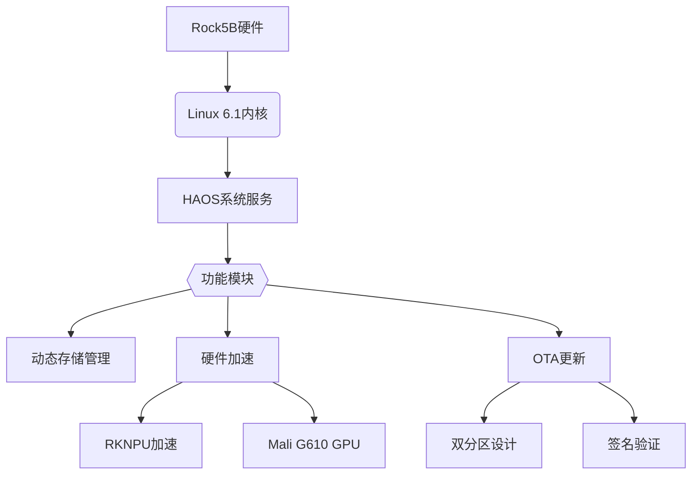

# HAOS Rock5B 项目蓝图

## 核心目标
🚀 为Radxa Rock5B开发板提供完整的Home Assistant OS支持
- 专为智能家居场景优化的嵌入式操作系统
- 提供从底层硬件到上层应用的完整解决方案
- 支持OTA安全更新和硬件加速功能

## 技术架构
### 基础架构
- **内核**: Linux 6.1 (Rockchip定制版)
  - 基于Armbian维护的Rockchip专用内核
  - 包含RK3588 SoC的专用补丁
  - 启用NEON和CRC指令集优化
- **构建系统**: Buildroot + 自定义配置
  - 通过BR2_EXTERNAL_HASSOS_PATH引用外部项目路径
  - 支持交叉编译和本地编译
- **文件系统**:
  - `/` (rootfs): erofs (只读)
  - `/data`: ext4 (可读写，支持自动扩容)
    - 使用writeback模式提高IO性能
    - 禁用atime/diratime减少磁盘写入
- **更新系统**: RAUC实现的A/B分区OTA更新
  - 兼容性标识为"haos-rock5b"
  - 限制更新包最大为1GB
  - 包含预安装和后安装脚本

## 技术栈图谱


## 核心组件
| 组件 | 功能 | 配置文件 | 维护要点 |
|------|------|----------|----------|
| U-Boot | 引导加载 | `uboot.config` | Rockchip SPL支持 |
| Linux内核 | 硬件驱动 | `kernel.config` | RK3588补丁集成 |
| RAUC | OTA更新 | `rauc.conf` | 证书管理 |
| HassOS Hook | 系统初始化 | `hassos-hook.sh` | 存储优化 |

## 安全特性
- **系统防护**:
  - 只读根文件系统
  - 强制首次密码修改
- **更新安全**:
  - X.509证书验证
  - 更新包完整性检查
- **网络防护**:
  - 自定义SSH端口
  - 密钥认证优先

## 构建流程
```bash
# 初始化环境
make setup

# 构建镜像 (输出到build/)
make image

# 生成OTA包 (输出到release/)
make ota-bundle
```

## 维护指南
1. 内核更新: 同步Rockchip官方仓库并应用`patches/`中的补丁
2. 硬件适配: 修改`board/radxa/rock5b/`下的配置文件
3. 功能调整: 通过`rock5b_defconfig`管理构建选项